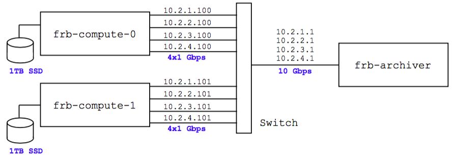

### MANUAL.md (ch_frb_l1)

This manual is incomplete and some sections are placeholders!

### CONTENTS

  - [High-level overview](#user-content-overview)
  - [Installation](#user-content-installation)
  - [Help! My pipeline is broken](#user-content-help-my-pipeline-is-broken)
  - [Quick-start examples which can run on a laptop](#user-content-laptop)
  - [Configuration file overview](#user-content-configuration-file-overview)
  - [L1 streams](#user-content-l1-streams)
  - [Examples on the two-node McGill backend](#user-content-two-node-backend)
  - [Config file reference: L1 server](#user-content-l1-config)
     - [High level parameters](#user-content-l1-config-high-level)
     - [Buffer sizes](#user-content-l1-config-buffer-sizes)
     - [File-writing](#user-content-l1-config-file-writing)
     - [L1b linkage](#user-content-l1-config-l1b)
     - [Misc](#user-content-l1-config-misc)
  - [Config file reference: L0 simulator](#user-content-l0-config)
  - [RPC reference](#user-content-rpc-reference)

Here are some external links to the bonsai documentation, which may also be useful:

  - [bonsai/MANUAL.md](https://github.com/CHIMEFRB/bonsai/blob/master/MANUAL.md)
  - [bonsai/examples_python](https://github.com/CHIMEFRB/bonsai/tree/master/examples_python)

<a name="overview"></a>
### HIGH-LEVEL OVERVIEW  

**Ingredients.** The main high-level components of the L1 code are:

  - ch-frb-l1: The "L1 server".

    This is the master executable, which receives UDP packets
    containing one or more beams, dedisperses each beam in a
    separate thread, and passes coarse-grained triggers to "L1b"
    (which runs as a separate process for each beam).

  - ch-frb-simulate-l0: The "L0 simulator".

    This is for testing the L1 server.  It simulates a packet stream
    and sends it to L1.  Right now it can only simulate noise, but
    FRB's will be added soon!

  - RPC client python library.  (To be documented later.)

  - Monitoring webapp.  (To be documented later.)

**Caveats.** The L1 server is not finished yet! Please note the following caveats:

  - The L0 simulator can only simulate noise; it cannot
    simulate pulses or replay RFI captures.

  - The L1 server doesn't pass timestamps (FPGA counts) to L1b yet.

  - In the full CHIME parameter space (roughly DM <= 13000 and
    pulse width <= 100 ms), there is currently a technical issue in the
    bonsai code which requires an artificially large bonsai chunk size
    (8 seconds).  This will be fixed soon!  This issue only affects the
    "production-scale" examples, not the subscale examples which can
    run on a laptop.

  - Another technical issue in the bonsai code: the "slow start".  The bonsai
    triggers are all-zero arrays at first, and gradually "activate" as time
    progresses.  This activation process takes ~100 seconds for the lowest DM's,
    and ~600 seconds for the highest DM's!  We will try to reduce these
    timescales in future versions.

    Note: because of the "slow start" problem, the two-node backend examples
    [3](#user-content-example3) and [4](#user-content-example4) in this manual
    have been increased from 5-minute runs to 20-minute runs.
    **NOTE that example 4 is currently broken and will be fixed soon.**

  - Currently, bonsai config files must be constructed by a two-step process as follows.
    First, a human-editable text file `bonsai_xxx.txt` is written (for an example, see
    bonsai_configs/bonsai_example1.txt).  Second, this must be processed into an HDF5
    file using the utility `bonsai-mkweight`:
    ```
    bonsai-mkweight bonsai_xxx.txt bonsai_xxx.hdf5
    ```
    where that the `bonsai-mkweight` utility is part of bonsai, not ch_frb_l1.

    Note that we don't put the HDF5 files in git, since they are large files, so you may need
    to create the hdf5 files by hand using the above procedure.  Exception: on the CHIME nodes, 
    the "production" HDF5 files should already be in `/data/bonsai_configs`.

  - Currently, 16K RFI removal is running slower than originally hoped (0.55 cores/beam),
    so we need to run with 8 beams/node rather than 16 beams/node.

    The L1 server supports either 8 or 16 beams, but currently our best 16-beam configuration
    uses "placeholder" RFI removal (which detrends the data but doesn't actually remove RFI) and the least optimal 
    bonsai configuration (no low-DM upsampled tree or spectral index search).  Our best 8-beam configuration
    uses a real RFI removal scheme developed by Masoud, and the most optimal bonsai configuration
    (with a low-DM upsampled tree and two trial spectral indices).  See [Example 3](#user-content-example3)
    and [Example 4](#user-content-example4) below.
    
  - The L1 server is **fragile**; if anything goes wrong
    (such as a thread running slow and filling a ring buffer)
    then it will throw an exception and die.

    I find that this is actually convenient for debugging, but
    for production we need to carefully enumerate corner cases and
    make sure that the L1 server recovers sensibly.

    Another nuisance issue: after starting a production-scale L1 server instance, 
    you'll need to wait ~60 seconds before sending packets, or it may crash!
    (This is to give the L1 server enough time to do all of its initial memory allocation.)
    
  - The code is in a "pre-alpha" state, and serious testing
    will probably uncover bugs!

<a name="installation"></a>
### INSTALLATION

The L1 code consists of the following git repositories.
Depending on what you're doing, you may only need a subset of these!
In particular, the modules marked "frb1 only" include hardcoded pathnames on
frb1.physics.mcgill.ca, and probably won't be useful on other machines.
For a dependency graph, see [doc/dependencies.png](./doc/dependencies.png).

  - [kiyo-masui/bitshuffle](https://github.com/kiyo-masui/bitshuffle):
    "bitwise" compression algorithm used throughout CHIME.
  - [kmsmith137/simd_helpers](https://github.com/kmsmith137/simd_helpers):
    header-only library for writing x86 assembly language kernels.
  - [kmsmith137/pyclops](https://github.com/kmsmith137/pyclops):
    some hacks for writing hybrid C++/python code.
  - [kmsmith137/rf_kernels](https://github.com/kmsmith137/rf_kernels):
    fast C++/assembly kernels for RFI removal and related tasks.
  - [kmsmith137/sp_hdf5](https://github.com/kmsmith137/sp_hdf5):
    header-only library for reading/writing hdf5 from C++.
  - [kmsmith137/simpulse](https://github.com/kmsmith137/simpulse):
    library for simulating FRB's and pulsars.
  - [CHIMEFRB/ch_frb_io](https://github.com/CHIMEFRB/ch_frb_io):
    networking code, CHIME-specific file formats.
  - [CHIMEFRB/bonsai](https://github.com/CHIMEFRB/bonsai):
    fast tree dedispersion on x86.
  - [kmsmith137/rf_pipelines](https://github.com/kmsmith137/rf_pipelines):
    plugin-based radio astronomy pipelines.  
    (Note: this repo now includes the web viewer code which was previously
    in [mburhanpurkar/web_viewer](https://github.com/mburhanpurkar/web_viewer).)
  - [mrafieir/ch_frb_rfi](https://github.com/mrafieir/ch_frb_rfi):
    scritping framework for RFI removal and offline L1 analysis.  **(frb1 only)**
  - [kmsmith137/ch_frb_l1](https://github.com/kmsmith137/ch_frb_l1):
    toplevel repo, whose README you're reading right now.

There are also a lot of external dependencies!  (For a complete list,
see [doc/install.md](./doc/install.md).)

If you're using one of the CHIME machines (frb1, frb-compute-X), then all
external dependencies should already be installed, and you can use one of the
following "cheat sheets" to install the L1 pipeline from scratch.

  - [Installing from scratch on frb1.physics.mcgill.ca](./doc/quick_install_frb1.md)
  - [Installing from scratch on an frb-compute-X compute node](./doc/quick_install_l1_node.md)

If you're using another machine (e.g. a laptop) then the installation process
is more involved.  You'll probably need to write some Makefile include files
("Makefile.local" files).  We hope to streamline this process at some point!
For now, please see:

  - [General-purpose install instructions](./doc/install.md)


<a name="help-my-pipeline-is-broken"></a>
### HELP! MY PIPELINE IS BROKEN

Since the pipeline is under continuous development, and updates to pipeline
modules depend on each other, at some point you may find yourself with an 
inconsistent set of modules.  In this case, you can use the following
"cheat sheet" to put all pipeline modules on their master branches,
update from git, and rebuild everything from scratch.

   - [Rebuilding the pipeline](./doc/rebuilding_pipeline.md)

**Warning:** one problem with our current build system is that it doesn't track dependencies
between repositories.  So for example, if you update bonsai and do `make install`, you 
should rebuild everything which depends on bonsai (for example rf_pipelines) from scratch.
Otherwise you can get unpredictable results, such as segfaults.

**Important:** In the previous paragraph, "rebuild from scratch" means `make clean; make all install`.
Rebuilding with `make all install` wouldn't be enough, since dependencies aren't being tracked between repositories!

For this reason, it's easier to end up with a broken pipeline than you might think.  If you get into trouble,
the "Rebuilding the pipeline" link above is a cut-and-paste "reset switch" which will rebuild the entire pipeline 
consistently from scratch.

<a name="laptop"></a>
### QUICK-START EXAMPLES WHICH CAN RUN ON A LAPTOP

<a name="example1"></a>
**Example 1:** simplest example: one beam, 1024 frequency channels, one dedispersion tree.
The L0 simulator and L1 server run on the same machine (e.g. a laptop), and exchange packets 
over the loopback interface (127.0.0.1).

  - **This step only needs to be done once.** Initialize the bonsai HDF5 file, 
    using the utility `bonsai-mkweight`, which should have been installed in 
    your $PATH when bonsai was built.  For more discussion of this step, 
    see the section ["The bonsai config file"](#user-content-bonsai-config) below.
    ```
    cd bonsai_configs/
    bonsai-mkweight bonsai_example1.txt bonsai_example1.hdf5
    cd ..
    ```

  - Start the L1 server:
    ```
    ./ch-frb-l1  \
       l1_configs/l1_example1.yaml  \
       rfi_configs/rfi_placeholder.json  \
       bonsai_configs/bonsai_example1.hdf5  \
       l1b_config_placeholder
    ```
    There are four configuration files, which will be described in the
    next section ([Configuration file overview](#user-content-configuration-file-overview)).

    After you start the L1 server, you should see the line "ch_frb_io: listening for packets..."
    and the server will pause.

  - In another window, start the L0 simulator:
    ```
    ./ch-frb-simulate-l0 l0_configs/l0_example1.yaml 30
    ```
    This will simulate 30 seconds of data.  If you switch back to the L1 server's window,
    you'll see some incremental output, as chunks of data are processed.  

    After it finishes, you'll see a line "toy-l1b.py: wrote toy_l1b_beam0.png".  This is a 
    plot of the coarse-grained triggers, with time on the x-axis and DM on the y-axis.  The
    plot will not contain any FRB's, because the simulation is pure noise.  Note that the blue 
    "stairstep" region in the left part of the plot is symptomatic of the "slow start" problem
    mentioned under "Caveats" near the beginning of this file.

<a name="example2"></a>
**Example 2:** similar to example 1, but slightly more complicated as follows.

We process 4 beams, which are divided between UDP ports 6677 and 6688 (two beams per UDP port).
This is more representative of the real L1 server configuration, where we process 4 beams/NIC
with either two or four NIC's (i.e. 8 or 16 beams total).
See the section [L1 streams](#user-content-l1-streams) below for more discussion.

In example 2, we also use three dedispersion trees which search different
parts of the (DM, pulse width) parameter space.  See comments in the bonsai
config files for more details (and MANUAL.md in the bonsai repo).
This is more representative of the real search, where we plan to use
6 or 7 trees (I think!)

The steps below are similar to example 1, so discussion is minimal.

  - **This step only needs to be done once.** Initialize the bonsai HDF5 file.
    ```
    cd bonsai_configs/
    bonsai-mkweight bonsai_example2.txt bonsai_example2.hdf5
    cd ..
    ```

  - Start the L1 server:
    ```
    ./ch-frb-l1  \
       l1_configs/l1_example2.yaml  \
       rfi_configs/rfi_placeholder.json  \
       bonsai_configs/bonsai_example2.hdf5  \
       l1b_config_placeholder
    ```
    There are four configuration files, which will be described shortly!

  - In another window, start the L0 simulator:
    ```
    ./ch-frb-simulate-l0 l0_configs/l0_example2.yaml 30
    ```

    After the example finishes, you should see four plots `toy_l1b_beam$N.png`,
    where N=0,1,2,3.  Each plot corresponds to one beam, and contains three
    rows of output, corresponding to the three dedispersion trees in this example.

<a name="configuration-file-overview"></a>
### CONFIGURATION FILE OVERVIEW

Before giving more examples, we pause to give an overview
of the various config files used in the L0 simulator
(ch-frb-simulate-l0) and the L1 server (ch-frb-l1).

#### ch-frb-simulate-l0 (the L0 simulator)

The command-line syntax for ch-frb-simulate-l0 is:
```
Usage: ch-frb-simulate-l0 <l0_params.yaml> <num_seconds>
```
The l0_params.yaml file contains high-level info such as
the number of beams being simulated, number of frequency
channels, etc.

I recommend looking at the toy examples first (l0_configs/l0_toy_1beam.yaml and
l0_configs/l0_toy_4beams.yaml) to get a general sense of what they contain.  For
detailed information on the L1 config file, see
["Config file reference: L0 simulator"](#user-content-l0-config) below.

#### ch-frb-l1 (the L1 server)

The command-line syntax for ch-frb-l1 is:
```
Usage: ch-frb-l1 [-fvpm] <l1_config.yaml> <rfi_config.json> <bonsai_config.hdf5> <l1b_config_file>
  -f forces the L1 server to run, even if the config files look fishy
  -v increases verbosity of the toplevel ch-frb-l1 logic
  -p enables a very verbose debug trace of the pipe I/O between L1a and L1b
  -m enables a very verbose debug trace of the memory_slab_pool allocation
  -w enables a very verbose debug trace of the logic for writing chunks
  -c deliberately crash dedispersion thread (for debugging, obviously)
```
The L1 server takes four parameter files as follows:

  - **The L1 config file (l1_config.yaml)**

    This is a YAML file which defines "high-level" parameters, such as the number of beams
    being dedispersed, and parameters of the network front-end code, such as ring buffer sizes.

    I recommend looking at the toy examples first (l1_configs/l1_toy_1beam.yaml and
    l1_configs/l1_toy_4beams.yaml) to get a general sense of what they contain.  For
    detailed information on the L1 config file, see
    ["Config file reference: L1 server"](#user-content-l1-config) below.

  - **The RFI config file (rfi_config.json)**

    This is a JSON file which defines the RFI removal algorithm.  It is
    read and interpreted by the rf_pipelines library.  Full documentation
    of the file format, and instructions for creating new versions of this
    file, will be forthcoming in a future releaes.

    Currently, there are two possibilities available in the `rfi_configs` directory:

      - `rfi_configs/rfi_placeholder.json`: a placeholder which detrends
        the data, but does not actually mask RFI.

      - `rfi_configs/rfi_production_v1.json`: a complex 16K-channel RFI removal
        chain developed by Masoud, which is working well on captured data from
        the 26m telescope and the CHIME pathfinder.  It is currently running
        slower than originally hoped (0.55 cores/beam), but we have some
        ideas for improving it and speeding it up.

        Note that this is the same as the file `json_files/rfi_16k/17-10-24-first-try.json`
        in the [ch_frb_rfi repository](https://github.com/mrafieir/ch_frb_rfi).  The idea
        is that RFI transform chains can be developed in the ch_frb_rfi "laboratory" and 
        copied to ch_frb_l1 when we want to use them in the real-time search.

<a name="bonsai-config"></a>
  - **The bonsai config file (bonsai_config.hdf5)**

    This file defines parameters related to dedispersion, such as number of
    trees, their level of downsampling/upsampling, number of trial spectral
    indices, etc.

    Currently, bonsai config files must be constructed by a two-step process as follows.
    First, a human-editable text file `bonsai_xxx.txt` is written (for an example, see
    bonsai_configs/bonsai_example1.txt).  Second, this must be processed into a "config HDF5"
    file using the utility `bonsai-mkweight`:
    ```
    bonsai-mkweight bonsai_xxx.txt bonsai_xxx.hdf5
    ```
    where that the `bonsai-mkweight` utility is part of bonsai, not ch_frb_l1.

    The config HDF5 file contains all of the information in an ordinary config file, plus some large binary arrays.
    The config HDF5 file is not human-readable, but can be inspected with `bonsai-show-config`.
    The binary array data in the config HDF5 file is needed by the L1 server, to do its real-time RFI-mask-filling
    and trigger variance estimation.

    Note that we don't put config HDF5 files in git, since they are large files, so you may need
    to create them by hand using the above procedure.  Exception: on the CHIME nodes, 
    the "production" config HDF5 files should already be in `/data/bonsai_configs`.

    If the L1 server fails with an error such as
    ```
    bonsai_xxx.txt: transfer matrices not found.  Maybe you accidentally specified a .txt file instead of .hdf5?
    ```
    then it's failing to find the binary array data it expects in the config HDF5 file.
    Most likely, this is because an ordinary bonsai config file was specified on the command line,
    instead of a config HDF5 file.

    The utility `bonsai-show-config` is useful for viewing the contents of
    a bonsai parameter file, including derived parameters such as the max DM
    of each tree.  The utility `bonsai-time-dedisperser` is useful for estimating
    the CPU cost of dedispersion, given a bonsai config file.  (These utilities
    are part of bonsai, not part of ch-frb-l1.)

    The bonsai library is the best-documented part of the L1 pipeline.
    For more information on bonsai, including documentation of the configuration
    file and pointers to example programs, see
    [CHIMEFRB/bonsai/MANUAL.md](https://github.com/CHIMEFRB/bonsai/blob/master/MANUAL.md).

  - **The L1b config file.**

    This file is not read by the L1 server itself (the L1 server does not even check
    whether a file with the given filename exists).  However, the filename is passed from the
    L1 server command line to the L1b command line in the following way.  When the
    L1 server is invoked with the command line:
    ```
    ch-frb-l1 <l1_config.yaml> <rfi_config.json> <bonsai_config.txt> <l1b_config_file>
    ```
    it will spawn one L1b subprocess for each beam.  These subprocesses are invoked
    with the command line:
    ```
    <l1b_executable_filename> <l1b_config_file> <beam_id>
    ```
    where the second argument is passed through from the L1 command line.

    In the quick-start examples from the previous section, the L1b subprocesses
    are instances of the 'toy-l1b.py' executable in the ch_frb_l1 repository.
    This is a toy program which "processes" the coarse-grained triggers by
    generating a big waterfall plot for each beam.  This is mainly intended
    as a way of documenting the L1a-L1b interface, but toy-l1b.py may also
    be useful for debugging, since it gives a simple way to plot the output
    of the L1 server.  It is worth emphasizing that "L1b" can be any
    python script which postprocesses the coarse-grained triggers!

<a name="l1-streams"></a>
### L1 STREAMS

Now is a good place to explain L1 streams.  The input data to the L1 node
is divided into multiple streams, with the following properties:

 - Each stream corresponds to a unique (ip_address, udp_port) pair.
   For example, a node with four network interfaces, using a single UDP
   port on each, would use four streams.

 - The beams received by the node must be divided evenly between streams.
   For example, if a node is configured with 16 beams and 2 streams, then
   the correlator is responsible for sending 8 beams to each of the node's
   two (ip_address, udp_port) pairs.

 - Each stream is handled by an independent set of threads, and has an
   independent RPC server.  For example, to tell the node to write all
   of its beams to disk, a separate RPC would need to be sent to every
   stream.
   
   If the node has multiple CPU's, then each stream's threads will be
   "pinned" to one of the CPU's.

The stream configuration of an L1 node is determined by the `ipaddr` and `port`
fields in the L1 configuration file.  There is one stream for each distinct
(ipaddr, port) pair.  See the section
[Config file reference: L1 server](#user-content-l1-config) for more info.

Now let's consider some examples.

  - The "production-scale" 16-beam L1 server, running on an L1 node with
    two CPU's, four 1 Gbps NIC's, and no link bonding.

    In this case, we need to use a different IP address on each NIC.
    Therefore, the L1 node would be configured to use four streams (one
    for each NIC), and the correlator nodes would need
    to be configured to send four beams to each IP address.

  - The "production-scale" 16-beam L1 server with link bonding.  (Link bonding
    is something we were experimenting with at one point, but are
    currently leaning toward not using.)

    In this case, the four NIC's behave as one virtual NIC with
    4 Gbps bandwidth and one IP address.  However, we still
    need to use two streams (rather than one), to divide processing
    between the two CPU's in the node.  The two streams would have
    the same IP address, but would use different UDP ports.  The
    correlator nodes would need to be configured to send 8 beams
    to each UDP port.

  - A "production" L1 server with 8 beams instead of 16 (assuming no
    link bonding).  In this case, there are two possibilities.  We could
    either use two streams (=NIC's) with four beams/NIC, or four streams
    (=NIC's) with two beams/NIC.  Currently, only the first of these
    is implemented in the L1 server.

  - A subscale test case running on a laptop.  In this case there
    is no reason to use more than one stream, but we sometimes use
    multiple streams for testing.

The L1 server can run in one of two modes:

  - A "production-scale" mode which assumes two 10-core CPU's, and
    either 16 beams (on four NIC's), or 8 beams (on two NIC's).
    In this mode, we usually use 16384 frequency channels.
    The L1 server will use 230 GB of memory!

  - A "subscale" mode which assumes <=4 beams, and either 1, 2, or 4 streams.
  
    This is intended for development/debugging (e.g. on a laptop).  In this
    case, you'll almost certainly want to decrease the number of frequency
    channels, so that the memory and CPU usage are reasonable.  With 1024
    frequency channels and 1-4 beams, the L0 simulator and L1 server should
    easily run on a laptop over the "loopback" network interface.


<a name="two-node-backend"></a>
### EXAMPLES ON THE TWO-NODE MCGILL BACKEND

For now, the "two-node McGill backend" refers to the network below.
The nodes are in a non-link-bonded configuration, with each of their four
1 Gbps NIC's on a separate /24 network.



Future versions of the manual will include examples which include
more machines, for example a file server.

<a name="example3"></a>
**Example 3:**

  - This is a 16-beam production-scale example.  It uses "placeholder" RFI removal
    (which detrends the data but doesn't actually remove RFI), and the least optimal
    bonsai configuaration (no low-DM upsampled tree or spectral index search).  As
    remarked above, this is currently the best we can do with 16 beams/node, due to
    the RFI removal running slower than originally hoped!

  - This is a two-node example, with the L0 simulator running on frb-compute-0,
    and the L1 server running on frb-compute-1.  We process 16 beams with 16384
    frequency channels and 1 ms sampling.  The total bandwidth is 2.2 Gbps,
    distributed on 4x1 Gbps NIC's by assigning four beams to each NIC.

  - Because of the "slow start" problem described in "Caveats" at the
    beginning of this manual, this example is now a 20-minute run (previously,
    it was a 5-minute run).

  - First, check that the node is in the network configuration shown above.
    This is not guaranteed to be the case, since we're still experimenting with	
    alternate network configurations!  You can check the configuration by doing `ifconfig -a`
    on each node, and checking that the IP addresses of each built-in gigabit NIC (eno*)
    are as follows:
    

    |      | frb-compute-0 | frb-compute-1  |
    |------|---------------|----------------|
    | eno1 | 10.2.1.100    | 10.2.1.101     |
    | eno2 | 10.2.2.100    | 10.2.2.101     |
    | eno3 | 10.2.3.100    | 10.2.3.101     |
    | eno4 | 10.2.4.100    | 10.2.4.101     |


  - On **frb-compute-1**, start the L1 server:
    ```
    ./ch-frb-l1  \
       l1_configs/l1_example3.yaml  \
       rfi_configs/rfi_placeholder.json  \
       /data/bonsai_configs/bonsai_production_noups_nbeta1_v2.hdf5  \
       l1b_config_placeholder
    ```
    It may take around 30 seconds for all threads and processes to start!
    Before going on to the next step, you should wait until messages of the 
    form "toy-l1b.py: starting..." appear.

    Note: On frb-compute-1 and the other CHIME nodes, the bonsai "production" HDF5 files have
    been precomputed for convenience, and are kept in `/data/bonsai_configs`.  This is why
    we were able to skip the step of computing the .hdf5 file
    from `bonsai_configs/bonsai_production_noups_nbeta1_v2.txt`.

  - On **frb-compute-0**, start the L0 simulator:
    ```
    ./ch-frb-simulate-l0 l0_configs/l0_example3.yaml 1200
    ```
    This simulates 20 minutes of data.  If you switch back to the L1 server window,
    you'll see some incremental output every 10 seconds or so, as coarse-grained triggers 
    are received by the toy-l1b processes.

  - When the simulation ends (after 5 minutes), the toy-l1b processes will write
    their trigger plots (toy_l1b_beam*.png).  These will be large files (20000-by-4000 pixels)!

**Notes on the two-node backend:**

  - Right now the following ports are open on the firewalls of the compute nodes: 5555/tcp, 6677/udp, 6677/tcp.
    If you need to open more, the syntax is:
    ```
    sudo firewall-cmd --zone=public --add-port=10252/udp --permanent
    sudo firewall-cmd --reload
    sudo firewall-cmd --list-all
    ```

  - You may run into a nuisance issue where the L1 process hangs for a long time (uninterruptible with control-C)
    after throwing an exception, because it is trying to write its core dump.  My solution is
    `sudo killall -9 abrt-hook-ccpp` in another window.  Let me know if you find a better one!

    A related issue: core dumps can easily fill the / filesystem.  My solution here is
    ```
    sudo su
    rm -rf /var/spool/abrt/ccpp*
    exit
    ```
    ...but be careful with rm -rf as root!

<a name="example4"></a>
**Example 4:**

  - This is an 8-beam production-scale example.  It uses a real RFI removal scheme developed by Masoud, and the most optimal
    bonsai configuration (with a low-DM upsampled tree and two trial spectral indices).

  - On **frb-compute-1**, start the L1 server:
    ```
    ./ch-frb-l1  \
       l1_configs/l1_example4.yaml  \
       rfi_configs/rfi_production_v1.json  \
       /data/bonsai_configs/bonsai_production_ups_nbeta2_v2.hdf5  \
       l1b_config_placeholder
    ```
    and wait for it to finish initializing (takes around 1 minute).

  - On **frb-compute-0**, start the L0 simulator:
    ```
    ./ch-frb-simulate-l0 l0_configs/l0_example4.yaml 1200
    ```

<a name="l1-config"></a>
### CONFIG FILE REFERENCE: L1 SERVER

As previously described in ["Configuration File Overview"](#user-content-configuration-file-overview),
the L1 server takes four configuration files (schematically l1_server.yaml, rfi.json, bonsai.hdf5, and l1b).
In this section, we document the first of these files (the L1 server config file) in detail.
The other three files are documented in other repositories (rf_pipelines, bonsai, chime_rfi_L1b).

There are some examples of the L1 server config file in the `ch_frb_l1/l1_configs` directory.

<a name="l1-config-high-level"></a>
##### L1 config: high-level parameters

  - `nbeams` (integer).

    Number of beams processed by the node.
    Must match the value of 'nbeams' in the L0 simulator's config file.

  - `nfreq` (integer).

    Number of frequency channels (usually 1024 in subscale testing, or 16384 in production-scale).
    Must match the value of 'nfreq' in the L0 simulator's config file.

  - `nt_per_packet` (integer).

    Number of time samples sent in each UDP packet.  Must match the value of 'nt_per_packet'
    in the L0 simulator's config file.

    There is currently a restriction that in order to use fast kernels,
    nt_per_packet must be 16.  In particular, you should take nt_per_packet=16 in production-scale
    runs, where fast kernels are usually a necessity.  If you're using slow kernels,	
    then the value of nt_per_packet is probably not very important.  (For more discussion
    of slow-vs-fast kernels, see 'slow_kernels' below.)

  - `fpga_counts_per_sample` (integer, default 384).

    Number of FPGA counts per time sample.  Must match the value of 'fpga_counts_per_sample'
    in the L0 simulator's config file.

    This is an indirect way of specifiying the sampling rate.  One FPGA count corresponds to	
    2.5 microseconds (hardcoded).  Therefore, the default value fpga_counts_per_sample=384
    corresponds to a sampling rate of 0.983 milliseconds.

    One use for this parameter is to artificially speed up or slow down test instances.
    For example, to run a "stress test" in which the L1 server is required to run 10%
    faster than normal, you can take fpga_counts_per_sample=349.  (Note that you'll also
    need to decrease the value of 'dt_sample' in the bonsai config file by 10%, and the
    max DM of the search will automatically decrease by 10%.)

  - `ipaddr` (either a string, or a list of strings).

    One or more IP addresses, for the L1 server's stream(s).  This can be either a list
    of strings (one for each stream), or a single string (if all streams use the same
    IP address).  IP addresses are specified as strings, e.g. "127.0.0.1".

  - `port` (either an integer, or a list of integers).

    One or more UDP ports, for the L1 server's stream(s).  This can be either a list
    of UDP ports (one for each stream), or a single UDP port (if all streams use the same
    port).

  - `rpc_address` (list of strings).

    The RPC server address for each stream, specified as a string in "zeromq" format
    (e.g. "tcp://127.0.0.1:5555").  The 'rpc_address' field must be a list whose length
    is equal to the number of streams on the L1 node, that is, the number of distinct
    (ipaddr, udp_port) pairs.

    The RPC address of each stream must be different (by specifying either a different IP
    address or TCP port for each stream).

  - `beam_ids` (list of integers, optional).

    If specified, this is a list of beam_ids which will be processed on the node.  (The
    low-level UDP packet format defines a 32-bit integer beam_id).  The length of the
    list must be 'nbeams'.

    If unspecified, beam_ids defaults to [ 0, ..., nbeams-1 ].

    Note that in a setup with multiple L1 nodes, we would currently need a separate config
    file for each node, because the beam IDs would be different!  This will be fixed soon,
    by defining config file syntax which allows the beam IDs to be derived from the L1 node's
    IP address.

<a name="slow-kernels"></a>
  - `slow_kernels` (boolean, default=false).

    By default (slow_kernels=false), the L1 server uses fast assembly-language kernels
    for packet-level operations such as decoding and buffer assembly.  However, there
    is currently a restriction: to use fast kernels, 'nt_per_packet' must be equal to 16,
    and 'nfreq' must be divisible by 2048.  If these conditions are not satisfied, you'll need
    to use slow_kernels=true.

    When running the L1 server at production-scale (~16 beams, ~16384 frequencies),
    you'll probably need to set slow_kernels=false, since the slow reference kernels
    may be too slow to keep up with the data.

<a name="l1-config-buffer-sizes"></a>
##### L1 config: parameters defining buffer sizes


  - `unassembled_ringbuf_nsamples` (integer, default 4096).

    The "unassembled" ring buffer sits between the network thread and assembler thread.
    If the assembler thread is running slow, then this ring buffer will start to fill up.
    The unassembled_ringbuf_nsamples parameter sets the size of the ring buffer, in time samples.

    Currently, if the unassembled ring buffer fills up, then the L1 server throws an exception.
    This behavior will eventually be replaced with some recovery logic which resets the server.

  - `assembled_ringbuf_nsamples` (integer, default 8192).

    The "assembled" ring buffer sits between the assembler thread and the dedispersion threads.
    If the dedispersion threads are running slow, then this ring buffer will start to fill up.
    The assembled_ringbuf_nsamples parameter sets the size of the ring buffer, in time samples.

    Currently, if the assembled ring buffer fills up, then the L1 server throws an exception.
    This behavior will eventually be replaced with some recovery logic which resets the server.

  - `telescoping_ringbuf_nsamples` (list of integers, optional).

    After data is processed by the assembler thread, it goes to the "telescoping" ring buffer,
    which saves it for later retrieval by RPC's.

    As the name suggests, the buffer is telescoping, in the sense that data is saved at
    multiple levels of time downsampling.  For example, the most recent 60 seconds of 
    data might be saved at full time resolution (1 ms), the next 60 seconds of data
    might be saved at 2 ms resolution, and the next 180 seconds might be saved at 4 ms
    resolution.

    The telescoping_ringbuf_nsamples field is a list of integers, which defines how many
    samples (i.e. milliseconds) are saved at each level of downsampling.  The scheme described
    in the previous paragraph could be configured as follows:
    ```
    # Telescoping ring buffer configuration
    #      60 seconds at 1 ms time resolution
    #   +  60 seconds at 2 ms time resolution
    #   + 180 seconds at 4 ms time resolution

    telescoping_ringbuf_nsamples = [ 60000, 60000, 180000 ]
    ```
    Note that the elements of the telescoping_ringbuf_nsamples list are _non-downsampled_
    sample counts, i.e. the number "180000" above corresponds to (180000 * 1 ms), not
    (180000 * 4 ms).

    If the telescoping_ringbuf_nsamples field is absent (or an empty list) then the
    telescoping ring buffer is disabled, and the node will not save data for RPC-based
    retrieval.

  - `write_staging_area_gb` (floating-point, default 0.0)

    Allocates additional memory (in addition to memory reserved for the assembled_ringbuf
    and telescoping_ringbuf) for "staging" intensity data after an RPC write request is
    received, but before the data is actually written to disk or NFS.

    The value of 'write_staging_area_gb' is the total memory reserved on the whole node
    in GB (i.e. not memory per stream, or per beam).  It is highly recommended to set this
    parameter to a nonzero value if you plan to save data with RPC's!

    Currently, there is some guesswork involved in setting this parameter, since it's
    hard to figure out how much memory is being used by other things (e.g. bonsai).
    I plan to address this soon!  In the meantime, I recommend 2 GB/beam for production-scale
    runs, and 0.1 GB/beam for subscale testing runs.


<a name="l1-config-file-writing"></a>
##### L1 config: file-writing parameters

  - `output_devices` (list of strings).

    This is a list of devices (or filesystems) on the L1 server which can be written to independently.
    Each output_device is identified by a pathname (usually the mount point of a filesystem) such as `/ssd`
    or `/frb-archiver1'.  Each output_device will get a separate I/O thread.

    When the L1 server needs to write a file, it looks for a "matching" output_device whose identifying pathname is a prefix
    of the filename being written.  For example, the output_device `/ssd` would match the filename `/ssd/dir/file`.
    The file will then be queued for writing by the appropriate I/O thread.

    In subscale testing on a laptop, I usually set `output_devices: [""]`, which creates one output_device
    which matches all filenames, and a single I/O thread to process all write requests.

    On the real nodes, I usually set:
    ```
    output_devices: [ "/ssd", "/frb-archiver-1", "/frb-archiver-2", "/frb-archiver-3", "/frb-archiver-4" ]
    ```
    which defines 5 file I/O threads, corresponding to (4 NIC's) + (1 SSD) in the node.
    Recall that the L1 node is configured so that it "thinks" the NFS server is four different
    servers, mounted on directories /frb-archiver1, /frb-archiver2, /frb-archiver3, /frb-archiver4.  
    File writes to each of these four filesystems will be sent from the corresponding NIC.

    Note that `output_devices: [ ]` (an empty list) means that the server spawns no I/O threads and all write_requests
    fail, whereas `output_devices: [""]` means that the server spawns one I/O thread which matches every write request.

  - `stream_filename_pattern` (currently a string, but a per-L1-stream list of strings should also be allowed!  Default is an empty string)

    If a nonempty string is specified, it should be a "filename pattern" such as `"chunk_(BEAM)_(CHUNK)_(NCHUNK).msg"`.  The
    L1 server will write every assembled_chunk to disk when it is created.

    Warning: this is intended for debugging, and can generate a lot of output very quickly!


<a name="l1-config-l1b"></a>
##### L1 config: parameters defining L1b linkage

  - `l1b_executable_filename` (string).

     Filename of the L1b executable.  The L1 server spawns
     L1b subprocesses using the following command line:
     ```
     <l1b_executable_filename> <l1b_config_filename> <beam_id>
     ```
     Here, l1b_config_filename is one of the command-line arguments when the L1 server is started
     (see [configuration file overview](#user-content-configuration-file-overview) above for the 
     L1 server command-line syntax).  The beam_id is an integer.

     When each L1b subprocess is spawned, its standard input (file descriptor 0) will be connected to a unix pipe
     which will be used to send coarse-grained triggers from L1a to L1b.  The bonsai configuration
     information (e.g. dimensions of coarse-grained trigger arrays) will also be sent over the
     pipe, so there is no need for the bonsai_config_filename to appear on the L1b command line.

     Currently, the L1b process should be written in python, and the `bonsai.PipedDedisperser`
     python class should be used to receive coarse-grained triggers through the pipe.  The
     program `toy-l1b.py` is a toy example, which "processes" coarse-grained triggers by
     combining them into a waterfall plot.

     If l1b_executable_filename is an empty string, then L1b subprocesses will not be spawned.

  - `l1b_search_path` (boolean, default=false).

     If true, then duplicate the actions of the
     shell in searching for the l1b executable, by trying all colon-separated directories
     in the $PATH environnment variable.

  - `l1b_buffer_nsamples` (integer, default=0).

    Number of time samples which can be buffered between L1a and L1b.

    Under the hood, this gets converted to a buffer size in bytes, which is used to set
    the capacity of the unix pipe between L1 and L1b.  The default (0) means that a
    system default pipe capacity is used (usually 64 kbytes, which is uncomfortably small).

    It is important to note that setting the capacity of a pipe is a linux-only feature!
    Therefore, on other operating systems, setting l1b_buffer_nsamples=0 is the only option.
    In linux, there is also a maximum allowed capacity (/proc/sys/fs/pipe-max-size).  If
    you get a permissions failure when increasing pipe capacity, then you probably need to
    increase the maximum (as root).

    A minor detail: when the L1 server computes the pipe capacity from l1b_buffer_nsamples, the buffer size
    will be rounded up to a multiple of the bonsai chunk size ('nt_chunk' in the bonsai config 
    file), and a little bit of padding will be added for metadata.

  - `l1b_pipe_timeout` (floating-point, default=0).

    Timeout in seconds for the unix pipe connecting L1a and L1b.

    This parameter determines what happens when L1a tries to write to the pipe and the pipe
    is full (presumably because L1b is running slow).  The dedispersion thread will sleep
    until the timeout expires, or the pipe becomes writeable, whichever comes first.  If a
    second write also fails because the pipe is full, then the L1 server will throw an
    exception.  (This will be replaced later by some recovery logic which resets the server.)

    **Important:** the default parameters (l1b_buffer_nsamples = l1b_pipe_timeout = 0) are asking for trouble!  
    In this case, the L1 server will crash if the pipe fills for an instant, and the pipe capacity will be a system 
    default (usually 64 kbytes) which is probably too small to hold the coarse-grained triggers from a single bonsai 
    chunk.  In this situation, the L1 server can crash even in its normal mode of operation, in the middle of sending
    a chunk of data from L1a to L1b.

    In the production L1 server, we plan to set l1b_pipe_timeout=0,
    but set l1b_buffer_nsamples to some reasonable value (say 4096, corresponding to a 4-second buffer).
    This solution is suitable for a real-time search, since it puts a hard limit on how far L1b can
    fall behind in its processing (4 seconds) before it is considered an error.  This configuration only works on Linux,
    which is OK for the real L1 nodes.  This configuration is used in example 3 above.

    In subscale testing, I like to set l1b_pipe_timeout to a reasonable value (a few seconds).
    In this configuration, there is no hard limit on how far L1b can fall behind cumulatively,
    as long as it calls PipedDedisperser.get_triggers() frequently enough.  This configuration
    is used in examples 1 and 2 above.

  - `l1b_pipe_blocking` (boolean, default=false).

    If true, then L1a's writes to the pipe will be blocking.
    This has the same effect as setting l1b_pipe_timeout to a huge value.

<a name="l1-config-misc"></a>
##### L1 config: miscellaneous parameters

  - `force_asnychronous_dedispersion` (boolean, default=false).

     Forces RFI removal and dedispersion to run in separate threads (shouldn't
     need to specify this explicitly, except for debugging).

  - `track_global_trigger_max` (boolean, default=false).

    If track_global_trigger_max=true, then the L1 server will keep track of the FRB with the
    highest signal-to-noise in each beam.  When the L1 server exits, it prints the signal-to-noise,
    arrival time and DM to the terminal.

    This was implemented for early debugging, and is a little superfluous now that L1b is integrated!

<a name="l0-config"></a>
### CONFIG FILE REFERENCE: L0 SIMULATOR

In this section, we document the YAML configuration file which is used by the L0 simulator.

  - `nbeams` (integer).

    Number of beams being simulated.
    Must match the value of 'nbeams' in the L1 server's config file.

  - `nfreq` (integer).

    Number of frequency channels (usually 1024 in subscale testing, or 16384 in production-scale).
    Must match the value of 'nfreq' in the L1 server's config file.

  - `nt_per_packet` (integer).

    Number of time samples sent in each UDP packet.  Must match the value of 'nt_per_packet'
    in the L1 server's config file.

  - `fpga_counts_per_sample` (integer, default 384).

    Number of FPGA counts per time sample.  Must match the value of 'fpga_counts_per_sample'
    in the L1 server's config file.

    This is an indirect way of specifiying the sampling rate.  One FPGA count corresponds to	
    2.5 microseconds (hardcoded).  Therefore, the default value fpga_counts_per_sample=384
    corresponds to a sampling rate of 0.983 milliseconds.

    One use for this parameter is to artificially speed up or slow down test instances.
    For example, to run a "stress test" in which the L1 server is required to run 10%
    faster than normal, you can take fpga_counts_per_sample=349.  (Note that you'll also
    need to decrease the value of 'dt_sample' in the bonsai config file by 10%, and the
    max DM of the search will automatically decrease by 10%.)
  
  - `ipaddr` (either a string, or a list of strings).

    This has the same meaning as the `ipaddr` parameter in the L1 config file (see above).

    It can either be a list of strings (one for each stream) or a single string
    (if all strings use the same IP address).  IP addresses are specified as strings, e.g. "127.0.0.1".

  - `port` (either an integer, or a list of integers).

    This has the same meaning as the `port` parameter in the L1 config file (see above).
    
    One or more UDP ports, for the L1 server's stream(s).  This can be either a list
    of UDP ports (one for each stream), or a single UDP port (if all streams use the same
    port).

  - `nthreads` (integer).

    Number of threads used by the L0 simulator.  This must be a multiple of the number of
    streams, i.e. the number of distinct (ipaddr, udp_port) pairs.  Usually I just set nthreads = nstreams.
    
  - `max_packet_size` (integer, default 8900).

    If running on a network with ethernet jumbo frames enabled, the default of 8900
    bytes is a good choice.  Otherwise, I suggest 1400.

  - `nfreq_coarse_per_packet` (integer, optional).

    If specified, this determines the number of "coarse" frequency channels sent per packet.
    A "coarse" frequency channel is always 1/1024 of the full CHIME band.  For example, if
    nfreq=16384, then one coarse frequency channel contains 16 "fine" frequency channels.

    If unspecified, then nfreq_coarse_per_packet will be automatically determined by
    the max_packet_size.  (We send as many frequency channels as possible, given the
    max packet size constraint, the number of beams and time samples, and some
    internal constraints of the code.)

<a name="rpc reference"></a>
### RPC REFERENCE

This will be documented systematically soon!

In the meantime, please see the memo [17-08-14-file-writing.pdf](./doc/17-08-14-file-writing.pdf)
from a telecon, which documents the the file-writing code.  It's not complete, but it's better than nothing!

